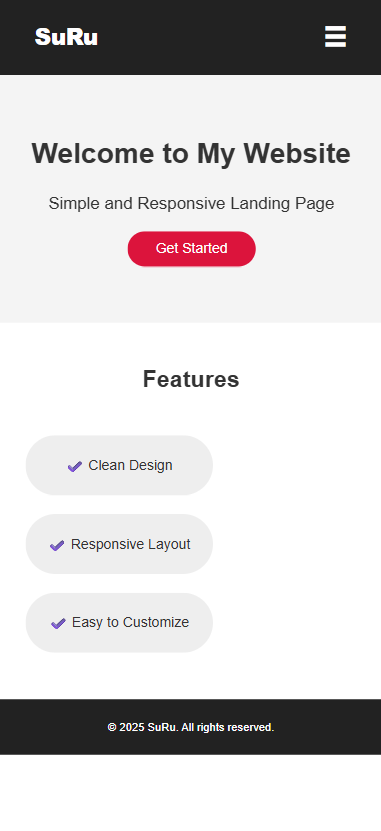

## 📌 Responsive Landing Page

### 📝 Description  
A simple yet modern **Responsive Landing Page** built using **HTML, CSS, and JavaScript**.  
It features a **hamburger menu for mobile devices** and **scroll animations** for a smooth user experience.

---

### 🔗 Live Demo  
[Live Demo Link](https://suru190.github.io/Responsive-Landing-Page/) 

---

### 📸 Screenshots  

**Desktop View:**  
  

### 📱 Mobile View


---

### ✨ Features  
✔ Fully Responsive Design (works on all devices)  
✔ Hamburger Menu for small screens  
✔ Smooth scroll animations for feature cards  
✔ Clean and minimal layout  
✔ Lightweight and fast  

---

### 🛠 Technologies Used  
- **HTML5** → Structure  
- **CSS3** → Styling and responsiveness  
- **JavaScript (Vanilla)** → Hamburger menu + scroll animations  

---

### ✅ What I Learned  
- How to create a **mobile-friendly navigation bar**  
- Implementing **CSS animations and transitions**  
- Handling **scroll events** in JavaScript  
- Better understanding of **responsive layouts**

---

### 📂 Project Structure  

```
Responsive-Landing-Page/
│── index.html
│── style.css
│── script.js
│── desktop-view.png
└── README.md
```
