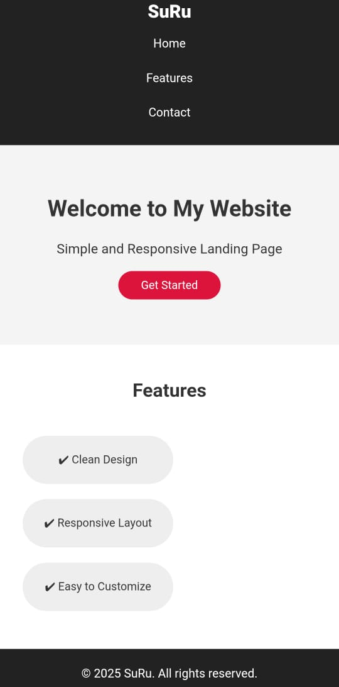

## Responsive Landing Page 🌐

This is a simple and clean **responsive landing page** built using HTML and CSS. It adjusts smoothly across desktop, tablet, and mobile screen sizes.

### 🔗 Live Demo
[Click here to view](https://suru190.github.io/Responsive-Landing-Page/)

---

## 📸 Screenshots

### 💻 Desktop View

### 📱 Mobile View *(optional)*

---

## ⚙️ Features

- Fully responsive layout
- Simple and clean design
- Mobile-first approach using media queries
- Centred, readable text

---

## 🧰 Tech Stack

- HTML5
- CSS3 (media queries, flexbox)

---

## 📈 Future Improvements

- Add hamburger menu for mobile navigation
- Animate elements on scroll
- Add form section or CTA
- Improve accessibility and semantic tags

---
